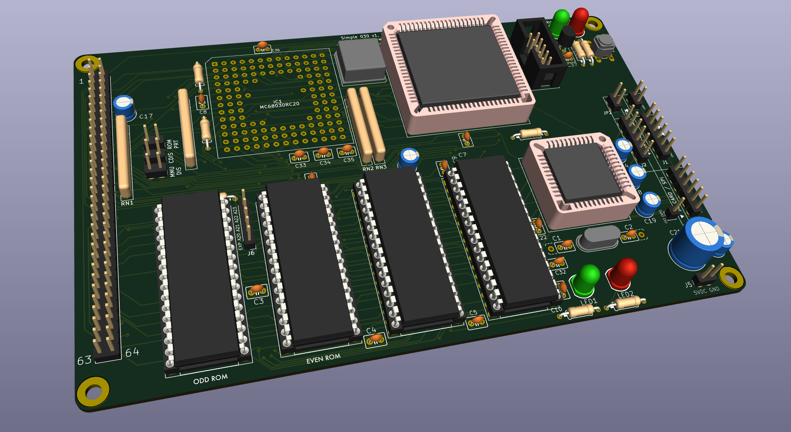

# Simple030
A simple 68030 SBC heavily based on the rosco_m68k 030 board and running that board's firmware.  

The idea is to run all the glue logic from a ATF1508 and to program the logic using verilog.  

Status of 11th Feb 2025, in design - not built or tested.  The verilog does program ok onto a ATF1508.  

